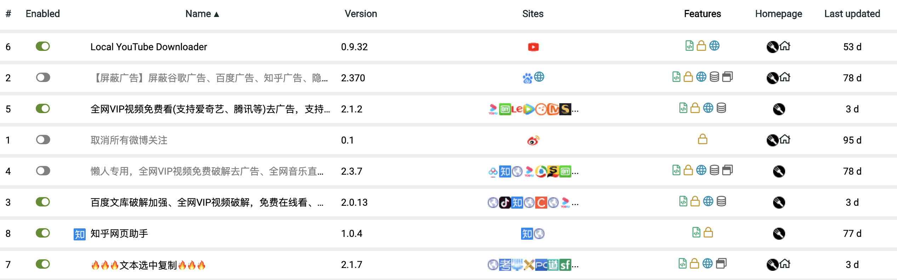

# Tampermonkey

## 1. Tampermonkey是什么

## 2. 插件下载网站

### 2.1 OpenUserJS

[OpenUserJS](https://openuserjs.org/) \([https://openuserjs.org](https://openuserjs.org/)\)继 GreasyFork 之后开始创办。它由 Sizzle McTwizzle 创建,同样地,在其储存库中也拥有大量的脚本资源。

*  大量的脚本资源
*  拥有可以从 Github、fork scripts 中进行脚本同步的功能
*  非常活跃的[开放源代码发展模式](https://github.com/OpenUserJs/OpenUserJS.org)

### 2.2 GreasyFork

[GreasyFork](https://greasyfork.org/)\([https://greasyfork.org](https://greasyfork.org/)\) 或许是最受欢迎的后起之秀了。它由 Jason Barnabe 创建,Jason Barnabe 同时也是 [Stylish](https://userstyles.org/) 网站的创办者,在其储存库中有大量的脚本资源。

*  大量的脚本资源
*  拥有可以从 Github 中进行脚本同步的功能
*  非常活跃的[开放源代码发展模式](https://github.com/JasonBarnabe/greasyfork)

## 3 我在用的插件

