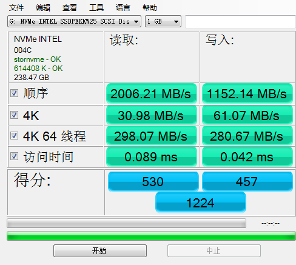

# Windows To Go安装Win10

## 手痒想体验Win10

好久没用Win 10，最近看到Win 10最新版的介绍感觉挺不错，各种交互细节和人性化操作方面越来越好了，所以想抽空装一个玩玩。正好手上有个闲置的intel 760P 256G SSD，正好可以用起来。

## 选择NVMe硬盘盒

淘宝上大概看了下，M.2 NVMe PCI-E接口的USB硬盘盒接口大概有3种：

<table>
  <thead>
    <tr>
      <th style="text-align:left">&#x63A5;&#x53E3;</th>
      <th style="text-align:left">&#x901F;&#x5EA6;</th>
    </tr>
  </thead>
  <tbody>
    <tr>
      <td style="text-align:left">
        

        
USB3.1 GEN 1

      </td>
      <td style="text-align:left">5Gbps</td>
    </tr>
    <tr>
      <td style="text-align:left">
        

        
USB3.1 GEN 2

      </td>
      <td style="text-align:left">
        

        
10Gbps

      </td>
    </tr>
    <tr>
      <td style="text-align:left">
        

        
Thunderbolt 3

      </td>
      <td style="text-align:left">
        

        
40Gbps

      </td>
    </tr>
  </tbody>
</table>

> **USB 3.1 Gen 1 与 USB 3.1 Gen 2 对比**
>
> USB 3.1 Gen 1 与 USB 3.1 Gen 2 仅在速度方面存在的区别。USB 3.1 Gen 1 最高支持 5Gbit/秒的速度，而 USB 3.1 Gen 2 最高支持 10Gbit/秒的速度。USB-IF 打算使用一套不同的名称来称呼 USB 3.1 Gen 1 和 USB 3.1 Gen 2，此举仅在市场宣传方面有所助益。它们希望将 USB 3.1 Gen 1 和 Gen 2 分别命名为“SuperSpeed USB”和“SuperSpeed USB+”，但这从未在行业内流行起来。通常，OEM 会将 5Gbps 或 10Gbps 速度添加到它们的规格表中，以区分这两种 USB 标准。业内其他方仅仅将它们称作“USB 3.1 Gen 1”或“USB 3.1 Gen 2”。

Thunderbolt 3接口的太贵；而USB3.1 GEN 1虽然便宜，但只有5Gbps，浪费了760P的速度。综合考虑后，觉得USB3.1 GEN 2的最佳，价格普遍在200元以内，接口速度与760P基本匹配（不会浪费SSD的高读写速度），品牌选择最多。

看了一些主控芯片的测评，唯一的感觉就是一分钱一分货，十分钱3分货，所以我最终选择了联想的一款USB 3.1 Gen 2硬盘盒。主控是最大众的JMS583，性能应该不会差到哪里去，价格也很美好。

硬盘盒到手后，发现联想自带的数据线还是Type-C+USB A转换头的两用线，这是个意外惊喜，正好方便在MAC和其他台式机上切换使用，不用带2条线出门。

## 安装Windows To Go

有3个方案选择

1. Win10企业版自带的Windows To Go
2. 第三方：WTG辅助工具（萝卜头IT论坛）-我选择的
3. 第三方：Rufus（没用过）

* 方案1\(Win 10自带WTG\)：没太多印象了，应该是支持Bitlocker全盘加密，改天有空再测试看看。`没选择他的原因好像是NVMe SSD在Win10下识别为SCSI硬盘，但WTG只能安装在可移动硬盘上，所以不得不借助第三方工具？`
* 方案2\(WTG辅助工具\)：支持VHD/VHDX虚拟硬盘和Bitlocker加密。`优点是不用占用全部磁盘分区，VHD用多少占用多少空间，分配的时候将VHD容量比SSD实际容量小几十G，剩余的空间可以当U盘用，读写速度飞得起，一举多得。`

当时决定做做这个WTG，也是考虑到一次性搞好节约时间，万一MBP故障，或者出门~~办事~~旅游紧急需要用电脑时，可以随便找一台机器插上WTG，迅速无缝切换到工作环境。所以我尽量把一些常用的软件登陆并配置好，像OneDrive、iCloud，GDrive等网盘，OneNOte、EverNote等云笔记，Lastpass,Chrome，VPN\(SS\)这些都必不可少。基于以上考虑，我的WTG磁盘启用了Bitlocker全盘加密。

### 安装Win10系统

在一台Win10机器上安装“WTG辅助工具”然后根据向导选择好操作系统ISO和可移动磁盘后，然后点"部署“，软件将自动执行，安装完毕后关机。

`这时候因为没装BootCamp，所以不能直接在MBP上启动，但是进桌面后，因为没有驱动，触摸板，WIFI,蓝牙等大部分外设都没有驱动，此时也办法联网。`

### 安装Bootcamp驱动

从第三方网站\([极限苹果](https://www.applex.net/pages/bootcamp/)\)下载对应型号的BootCamp驱动到另一个U盘，然后将WTG硬盘接到一台普通PC上（建议有线键盘/鼠标，或带无线接收器的无线键盘/鼠标）。从WTG启动后，插上有BootCamp驱动的U盘，打开U盘中的BootCamp安装文件，一路Install安装完毕，然后关机。

### MacBook启动WTG Win10

此时再将WTG接上MBP，按住ALT键然后开机，会出现MAC内置硬盘和外接的移动硬盘。选择从外接硬盘启动，就可以在MBP上运行WTG了。进系统后，等待一段时间系统自动安装好常用驱动，然后再连接WIFI，开启系统自动更新，联网下载一些未知设备的驱动。

等所有系统补丁和硬件驱动安装完毕，重启再进系统，即可正常使用Win10了。

## intel 760P测速

系统正常启动后，来对比下Typc-C接口和原生M.2接口的硬盘测速，不得不说这个主控还是不行，运行一段时间后因为发热导致速度下降得特别厉害。

### 台式机M.2接口上的测速

之前刚买来时候的测速截图，760P在台式机上的读写速度都很不错，对得起400多的价格。

### MBP上的Type-C接口测速

刚开机时接近USB 3.1 Gen 2接口满速，基本能接受。

WTG运行6小时后，硬盘盒极度烫手的情况下的测速，掉速厉害。

NVMe SSD别的什么都好，就是发热太大了。不确定这种掉速是硬盘发热导致的，还是硬盘盒主控导致的，等有机会换个别的主控硬盘盒再来上图补充。

update:2020-04-20

